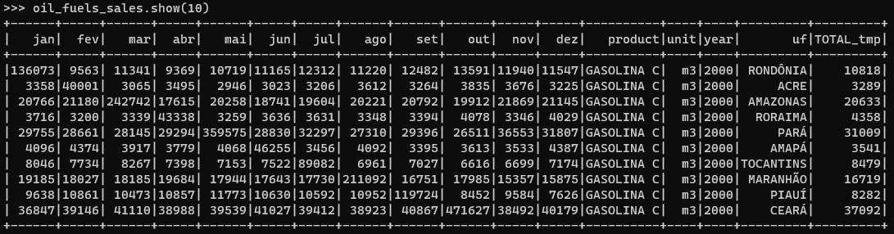
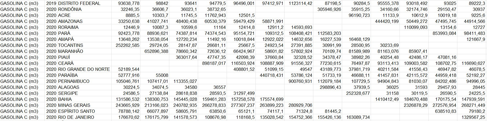
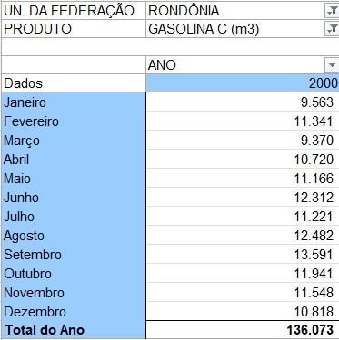
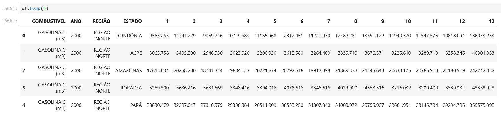

# aws-anp-fuel-sales-etl

# Objective

This ETL pipeline aims to extract the internal pivot caches from consolidated reports made available by Brazilian government's regulatory agency for oil/fuels, ANP (Agência Nacional do Petróleo, Gás Natural e Biocombustíveis), and serve the data to be consumed by the users.

The source data could be found in this [link](https://github.com/raizen-analytics/data-engineering-test/raw/master/assets/vendas-combustiveis-m3.xls), and the main information to be extracted are:
- Sales of oil derivative fuels by UF and product
- Sales of diesel by UF and type

# Architecture

This project uses AWS Cloud applications. All the steps are orchestrated by Airflow (deployed in an EC2 machine).

## The pipeline
1. The Python Operator is called to download the Excel file and convert it to enable access to information about the internal dynamic caches. The tables are extracted, fixed (data shift problem), transformed in parquet files and stored at the Bronze bucket.

2. The EMR Spark application is called to process the table sales_oil_fuels. The data is transformed, the schema is applyed and the data is stored in the silver layer.

3. The EMR Spark application is called to process the table sales_diesel. The data is transformed, the schema is applyed and the data is stored in the gold layer.

TODO: To add more information about the remaining steps.

# Requisites for the deploy
- AWS CLI (in your local machine)
- Terraform (in your local machine)
- Docker (in the EC2 virtual machine)
- Docker-compose (in the EC2 virtual machine)

# Deploy
TODO: To add information about the architecture deploy.

# Data problem

It was notice that the data was shifted after the file conversion proccessing. After loading the raw data, it becomes clear that the total does not match the sum of the columns.

Here, we can see the data shifted:

Here's what was expected for the first record:

It was implemented an algorithm to fix the data shifted. This is the result:

# Next steps:

1. Review and document the Airflow's DAG
1. Create code for the table to be accessed by Athena.
1. Create a Great Expectation task in Airflow to validate the data source.
1. Document the deploy process
